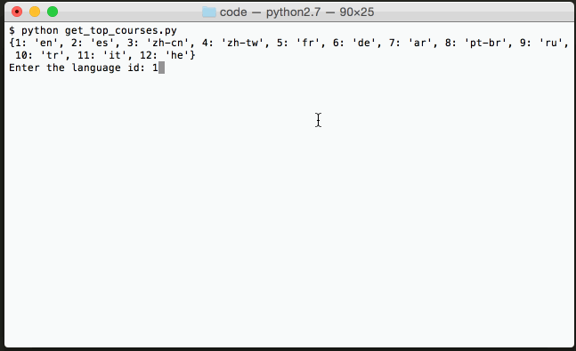

# Coursera Analytics
* Source Code for my blog post: [Hacking Education with Python - Data Mining Coursera for Popular Courses](http://adilmoujahid.com/posts/2015/03/coursera-data-mining/)



## Dependencies
The code requires ```Python 2.6+``` and ```Pandas``` library.

## Getting started

The ```Python``` script ```get_top_courses.py``` reads ```coursera_with_sharedcount.tsv``` and return the top courses based on the users' input. 

```
$ python get_top_courses.py
```

If you want to refresh the data, you need to execute ```Python``` script ```get_data.py```. 

*  Create a sharedcount.com account and put your API key to ```SHAREDCOUNT_API_KEY```.
```python
SHAREDCOUNT_API_KEY = 'XXXXXXXXXXXX'
```
* Run ```get_data.py``` script.

```
$ python get_top_courses.py
```


#Visit my Blog : http://adilmoujahid.com